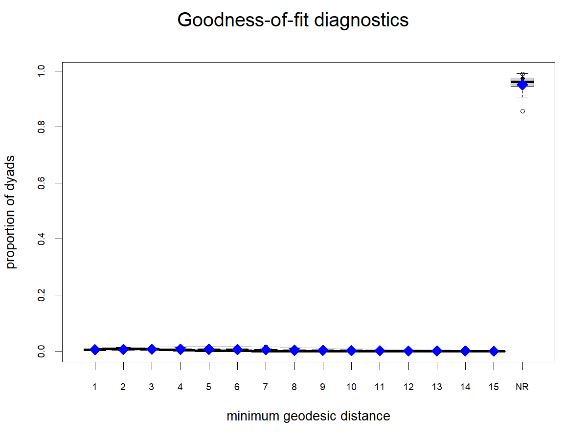

# ERGM Preparation and Descriptive Relationship Measures

This report prepares the **Inferential Modeling & Analysis (ERGM)** and **Relationship Measures & Descriptive Analysis** part of the SNAP Track 1 Venmo project. It uses the GitHub repo's existing `outputs/network_object.RData` as the only data input.

The current work deliberately does **not** modify raw data, sampling, or network construction. The upstream data and network logic remain owned by the earlier pipeline scripts.

## Analysis Focus

The proposal's broader intuition is that public Venmo transactions may leak private relationship information through network position and neighbors' activity. My part focuses on what can be learned from the ERGM-ready network after the data preparation and network construction steps are already complete.

Because the committed network object does not include raw memo text, emoji, timestamps, or audience fields, this analysis cannot directly label romantic relationship status. Instead, it uses **structural and behavioral proxies** for relationship strength: repeated transactions, reciprocity, and shared-neighbor embeddedness. These proxies support a privacy-risk argument, but they are not ground-truth relationship labels.

## Existing Analysis Network

The existing network object is directed and contains 206 nodes and 289 directed edges. I treat this as the analysis handoff from the data/network-construction step rather than changing the sampling strategy here. Substantively, the smaller network is useful for this ERGM analysis because the question is local: can repeated, reciprocal, and embedded transaction ties reveal relationship strength within a public transaction neighborhood? The tradeoff is that this network can demonstrate a plausible privacy risk, but it should not be read as a population estimate for all Venmo users.

Key descriptive results from `outputs/analysis/network_summary.csv`:

| Measure | Value |
|---|---:|
| Nodes | 206 |
| Directed edges | 289 |
| Density | 0.0068 |
| Reciprocated directed edges | 48 |
| Mutual dyads | 24 |
| Reciprocity edge share | 16.6% |
| Weak components | 1 |
| Largest weak component | 206 nodes |
| Global transitivity, undirected projection | 0.0522 |
| Maximum in-degree | 64 |
| Maximum out-degree | 11 |

The network is sparse but connected in weak-component terms. The in-degree distribution is highly skewed, which matters for ERGM specification because simple edge and triangle terms alone are likely to underfit degree heterogeneity.


## Relationship Measures

The relationship-strength proxy is designed to stay faithful to what is actually present in `network_object.RData`.

| Proxy | Rule | Count | Share of directed edges |
|---|---|---:|---:|
| High-frequency ties | `n_transactions >= 2` | 50 | 17.3% |
| Reciprocated ties | Reverse-direction edge exists | 48 | 16.6% |
| Embedded ties | At least 1 common neighbor | 122 | 42.2% |
| Relationship-strength proxy ties | At least two of high-frequency, reciprocated, embedded | 60 | 20.8% |

Logic:

- **Frequency** captures repeated interaction rather than one-off payments.
- **Reciprocity** captures two-sided exchange, which is closer to an ongoing relationship than a single directional payment.
- **Embeddedness** captures whether a dyad is situated in a local social neighborhood.
- The combined proxy avoids overclaiming from any single signal by requiring at least two forms of evidence.

These measures are descriptive; they are not used as endogenous predictors in the ERGM because they are computed from the same observed network being modeled.


## ERGM Specification Logic

The ERGM setup follows the lecture's MTML framing: the observed network is the dependent variable, and model terms represent hypothesized network-generating mechanisms.

The specification follows three rules from the lecture and ERGM documentation:

- Start with a sparsity baseline. The `edges` term is the intercept-like baseline tie propensity.
- Add theoretically motivated directed structure. The `mutual` term tests whether directed Venmo payments tend to be reciprocated.
- Use geometrically weighted terms for degree and closure. `gwidegree`, `gwodegree`, and `gwesp` screen degree heterogeneity and shared-partner closure without relying on long lists of raw star or triangle counts, which can be unstable in sparse social networks.

Staged models:

| Model | Formula | Purpose |
|---|---|---|
| M1 | `edges` | Baseline tie propensity / network sparsity |
| M2 | `edges + mutual` | Tests reciprocity in directed payments |
| M3 | `edges + mutual + gwidegree + gwodegree` | Screens degree heterogeneity |
| M4 | `edges + mutual + gwidegree + gwodegree + gwesp` | Screens shared-partner closure |

The committed vertex attribute `degree` is not used as a predictor because it is derived from the same network. Using it as an exogenous covariate would create circular interpretation. The `date_joined` attribute is available for future modeling, but this preparation pass does not use it because the substantive relationship between join date and tie formation has not been justified yet.

The models are currently fit with MPLE for fast preparation and screening. Final inferential claims should refit the selected stable model with MCMLE, then report convergence diagnostics and goodness-of-fit simulations.

This is why the current report labels the models as screening models. The statnet ERGM tutorial emphasizes that once dyad-dependent terms are included, final interpretation should come after MCMC convergence checks and goodness-of-fit assessment. The current outputs prepare that path by fitting the staged formulas, exporting coefficients, and saving an initial GOF figure for the most complete screening model.

## ERGM Screening Results and Model Choice

All four staged MPLE screening models fit successfully.

| Model | Key interpretation |
|---|---|
| M1 | Baseline edge log-odds are strongly negative, consistent with a sparse network. |
| M2 | `mutual` has a large positive coefficient; reciprocated ties are far more likely than random independent directed ties. |
| M3 | Degree heterogeneity matters, especially for in-degree concentration. |
| M4 | Shared-partner closure is positive, meaning ties are more likely when endpoints are locally embedded. |

In the full closure model, the screening odds ratios are approximately:

| Term | Estimate | Odds ratio |
|---|---:|---:|
| `edges` | -5.235 | 0.005 |
| `mutual` | 2.683 | 14.626 |
| `gwideg.fixed.0.5` | -1.299 | 0.273 |
| `gwodeg.fixed.0.5` | 0.768 | 2.156 |
| `gwesp.OTP.fixed.0.5` | 1.410 | 4.095 |

Among the screening models, M4 is the most defensible preferred specification. It has the lowest AIC/BIC among the staged models (M2 AIC = 3231, M3 AIC = 3128, M4 AIC = 2940), and it also matches the substantive story better than a simpler reciprocity-only model. The privacy concern is not only that two users pay each other back; it is that repeated and reciprocal ties sit inside a visible local neighborhood. Adding degree terms accounts for the skewed degree distribution, and adding `gwesp` captures whether ties cluster through shared partners.

M2 is still useful as a simpler baseline because the reciprocity effect is large and easy to interpret. M3 improves on M2 by accounting for degree concentration, but the out-degree term is not informative there. M4 is preferable for the current analysis because closure becomes strongly positive while reciprocity remains positive, suggesting that the observed transaction network contains both direct mutual exchange and local embeddedness.

These coefficients should be read as model-screening evidence, not final causal claims. The standard errors come from MPLE, so a final paper should be careful not to overstate them as full MCMLE inference.

## Goodness-of-Fit Checks

I ran GOF checks for the preferred screening model, M4, using in-degree, out-degree, minimum geodesic distance, edgewise shared partners, and dyadwise shared partners. These checks ask whether networks simulated from the fitted model reproduce important observed structures beyond the exact statistics used to estimate the model.



The GOF summary below reports the share of active observed categories that fall inside the simulated 95% interval from 30 simulated networks.

| GOF check | Active categories within simulated 95% interval |
|---|---:|
| In-degree distribution | 57.1% |
| Out-degree distribution | 72.7% |
| Minimum geodesic distance | 90.9% |
| Edgewise shared partners | 40.0% |
| Dyadwise shared partners | 60.0% |

This is a mixed but informative result. M4 captures the broad distance structure well and does reasonably on out-degree, but it does not fully reproduce the shared-partner distributions. That makes sense substantively: the same closure pattern that is central to relationship inference is also the hardest part of the network to fit cleanly. I would still prefer M4 over M2 or M3 for the current analysis because it directly models embeddedness and has better AIC/BIC, but I would describe it as the best screening specification rather than a finalized inferential model.

## References for ERGM Specification

- Statnet Development Team. [Exponential Random Graph Models using statnet](https://statnet.org/workshop-ergm/ergm_tutorial.html). This tutorial motivates model specification, coefficient interpretation, convergence diagnostics, goodness-of-fit checks, and degeneracy assessment.
- CRAN R Documentation. [`ergm`: Exponential-Family Random Graph Models](https://search.r-project.org/CRAN/refmans/ergm/html/ergm.html). This documents ERGM estimation, including MPLE and Monte Carlo likelihood approaches.
- Hunter, Handcock, Butts, Goodreau, and Morris. [ergm: A Package to Fit, Simulate and Diagnose Exponential-Family Models for Networks](https://pmc.ncbi.nlm.nih.gov/articles/PMC2743438/). This explains terms such as geometrically weighted degree and edgewise shared partner statistics.
- Pattison, Robins, Snijders, and Wang (2013). [Conditional estimation of exponential random graph models from snowball sampling designs](https://doi.org/10.1016/j.jmp.2013.05.004). This supports the principle that large networks often require tractable sampling or link-tracing designs for ERGM estimation.

## Reproducibility

Run the analysis with the project conda R environment:

```powershell
& 'C:\Users\15989\anaconda3\Scripts\conda.exe' run -p 'C:\Users\15989\Documents\New project\snap\.conda-r-ergm' Rscript scripts/04_descriptive_ergm_analysis.R .
```

Primary outputs:

- `outputs/analysis/network_summary.csv`
- `outputs/analysis/relationship_proxy_summary.csv`
- `outputs/analysis/ergm_model_status.csv`
- `outputs/analysis/ergm_coefficients.csv`
- `outputs/analysis/figures/degree_distribution.png`
- `outputs/analysis/figures/transaction_count_distribution.png`
- `outputs/analysis/figures/relationship_proxy_prevalence.png`
