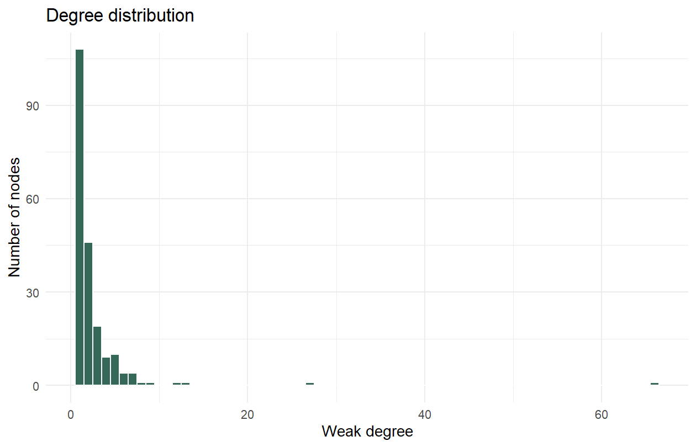
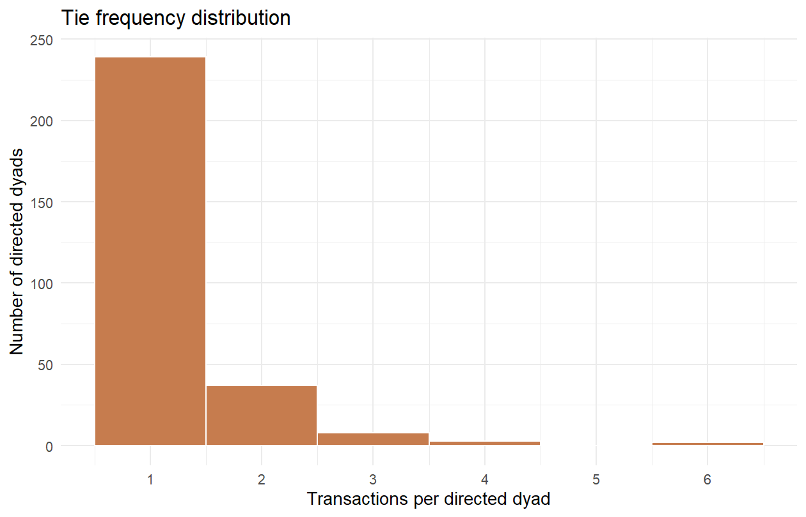
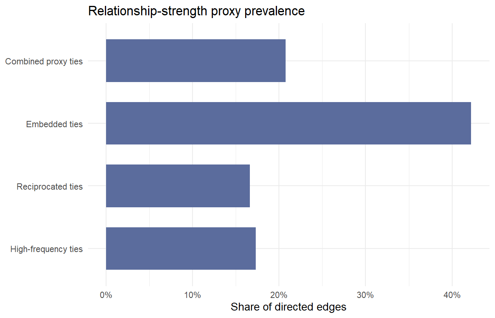
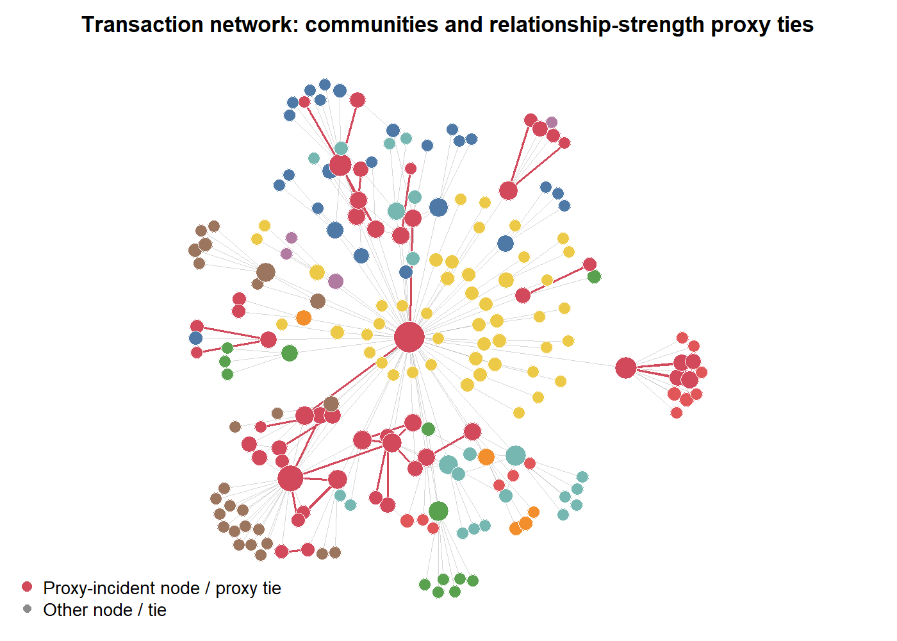
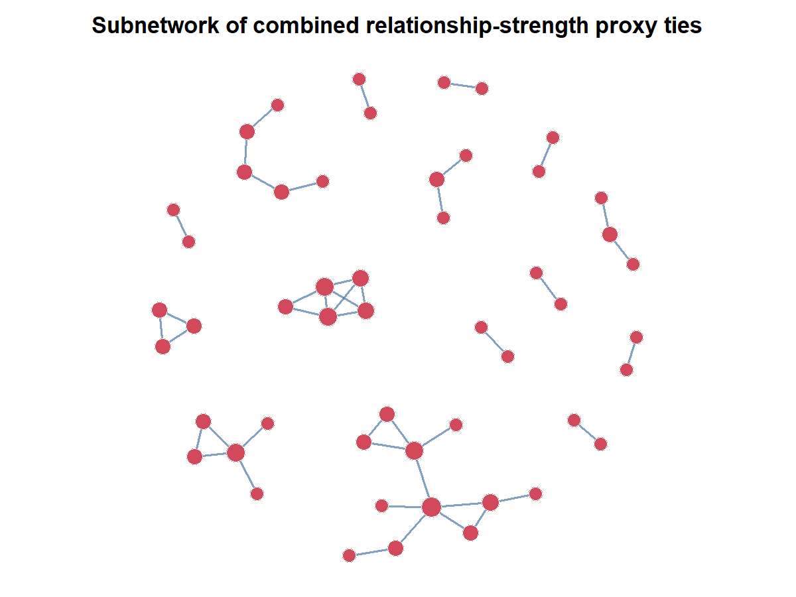
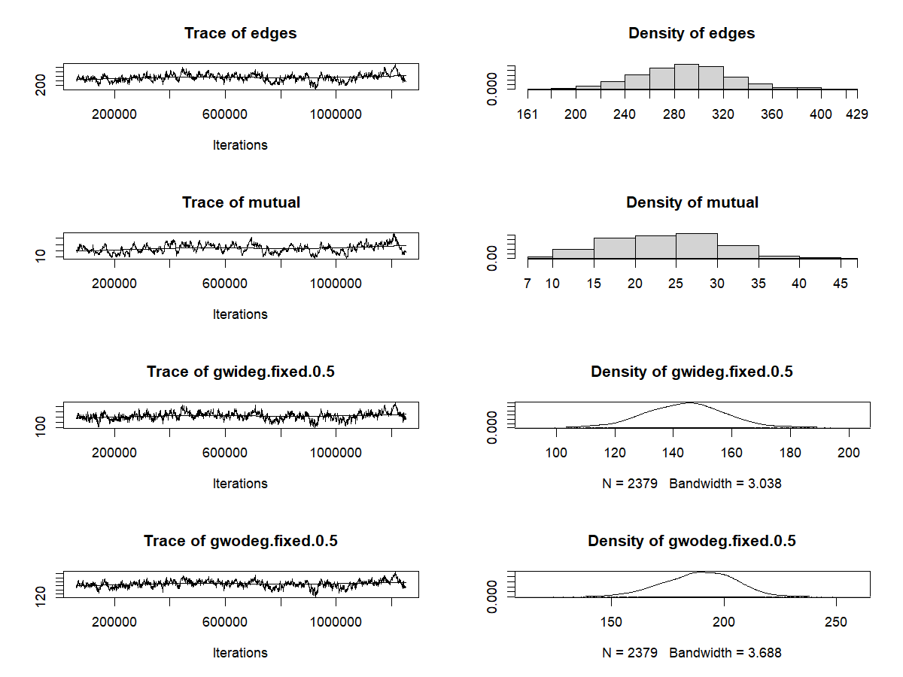
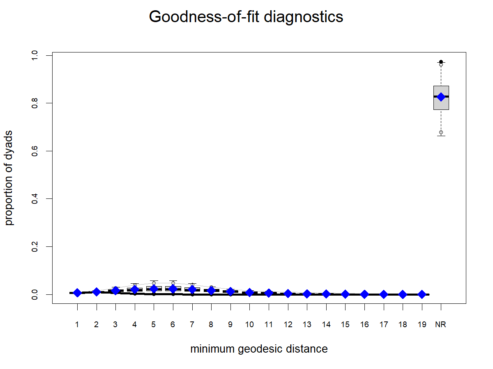

# Relationship Measures, Descriptive Analysis, and ERGM Preparation

This section prepares the **Relationship Measures & Descriptive Analysis** and **Inferential Modeling & Analysis (ERGM)** parts of the SNAP Track 1 Venmo project. It uses the existing GitHub network object, `outputs/network_object.RData`, as the only input.

I do not modify the raw data, sampling, or network-construction pipeline here. The analysis starts after the 206-node network has already been built.

## Analysis Scope

The project question is whether public Venmo transaction networks can reveal private relationship signals. The network object does not include raw memo text, emojis, timestamps, or verified romantic relationship labels, so the analysis does not claim to identify actual couples. Instead, it uses network structure to measure **relationship-strength signals** that are observable from the transaction graph: repeated ties, reciprocal ties, and ties embedded in shared neighborhoods.

That framing is important for interpretation. The descriptive measures show which transaction ties look stronger or more socially embedded than ordinary one-off payments. The ERGM then asks whether those same structural patterns are systematically present in the network after accounting for baseline sparsity and degree heterogeneity.

## What Counts as Descriptive Analysis

The descriptive-analysis portion includes four parts:

| Descriptive component | What it contributes |
|---|---|
| Existing analysis network | Basic node, edge, density, reciprocity, component, and degree-skew summaries |
| Relationship-strength measures | Counts and shares of high-frequency, reciprocated, embedded, and combined proxy ties |
| Community and clustering summaries | Louvain communities, local clustering, and whether proxy ties concentrate in local neighborhoods |
| Network visualizations | Whole-network community/proxy map and proxy-tie subnetwork |

These pieces describe the observed network before inferential modeling. They are separate from the ERGM coefficients, model diagnostics, and goodness-of-fit checks, which belong to the inferential-analysis portion.

## Existing Analysis Network

The existing directed network contains 206 nodes and 289 directed edges.

| Measure | Value |
|---|---:|
| Nodes | 206 |
| Directed edges | 289 |
| Density | 0.0068 |
| Reciprocated directed edges | 48 |
| Mutual dyads | 24 |
| Reciprocity edge share | 16.6% |
| Weak components | 1 |
| Largest weak component | 206 nodes |
| Isolates | 0 |
| Maximum in-degree | 64 |
| Maximum out-degree | 11 |
| Total degree skew | 9.845 |
| Global transitivity, undirected projection | 0.052 |
| Average local clustering, undirected projection | 0.175 |
| Louvain communities | 18 |
| Largest Louvain community | 45 nodes |

The network is sparse but weakly connected. The most important descriptive feature for ERGM specification is the skewed degree distribution: one node receives far more incoming ties than most others. A reciprocity-only ERGM would miss that concentration, so the inferential models need degree terms before any closure interpretation is credible.



## Relationship Measures

The relationship-strength proxy uses only information already present in the observed network.

| Proxy | Rule | Count | Share of directed edges |
|---|---|---:|---:|
| High-frequency ties | `n_transactions >= 2` | 50 | 17.3% |
| Reciprocated ties | Reverse-direction edge exists | 48 | 16.6% |
| Embedded ties | At least 1 common neighbor | 122 | 42.2% |
| Combined relationship-strength proxy ties | At least two of high-frequency, reciprocated, embedded | 60 | 20.8% |

The intuition is straightforward. Repeated transactions suggest more than a single accidental or one-time exchange. Reciprocity suggests two-sided interaction. Embeddedness suggests that the tie sits inside a shared social neighborhood rather than being an isolated payment. Requiring at least two signals keeps the proxy conservative and avoids treating every common-neighbor tie as a meaningful relationship.

These are descriptive relationship measures, not dependent variables in the ERGM. They help motivate the modeling question, but the ERGM models the whole network structure rather than predicting the proxy label directly.





## Community Structure and Network Visualizations

The undirected projection of the transaction network has 18 Louvain communities. The largest community contains 45 nodes, while several smaller communities contain denser local pockets of proxy ties. This supports the project intuition that relationship-strength evidence is not only dyadic. Some stronger-looking ties appear in small local neighborhoods where repeated, reciprocal, or embedded payments are visible to observers.

The first visualization maps the full 206-node network. Node size reflects degree. Red edges are combined proxy ties, and red nodes are incident to at least one proxy tie. This is a descriptive visualization of where stronger relationship signals sit in the overall network.



The second visualization keeps only the combined relationship-strength proxy ties. This makes the privacy-risk argument more concrete: even after filtering to stronger structural signals, the remaining ties form visible small components rather than disappearing as isolated noise.



## ERGM Specification Logic

The ERGM treats the observed directed transaction network as the outcome. Each model term represents a possible network-generating mechanism:

| Model | Formula | Purpose |
|---|---|---|
| M1 | `edges` | Baseline sparsity |
| M2 | `edges + mutual` | Directed reciprocity |
| M3 | `edges + mutual + gwidegree + gwodegree` | Reciprocity plus in-degree and out-degree heterogeneity |
| M4 | `edges + mutual + gwidegree + gwodegree + gwesp` | Adds shared-partner closure |

This staged specification follows the lecture intuition for ERGMs: start with baseline tie probability, then add theoretically meaningful dependence terms. I do not use the committed vertex attribute `degree` as a nodal covariate because it is derived from the same network. Treating observed degree as an exogenous predictor would make the interpretation circular.

I first fit all four models with MPLE as a screening step. Then I refit the plausible final candidates with MCMLE and use diagnostics to decide which model is defensible as the final ERGM.

## ERGM Results and Model Choice

The MPLE screening step suggested that M4 was substantively attractive because the shared-partner closure term was positive and the model had the lowest screening AIC/BIC. However, the MCMLE refit changed the final choice. M2 and M3 fit successfully under MCMLE, while M4 triggered the ERGM density guard, which is a warning sign for degeneracy or a poor simulated-network region.

For that reason, **M3 is the preferred final ERGM specification**. It is more defensible than M2 because it accounts for the highly skewed in-degree distribution, but it is safer than M4 because it avoids the closure specification that failed the MCMLE stability check.

Final MCMLE coefficients:

| Model | Term | Estimate | Odds ratio | Interpretation |
|---|---|---:|---:|---|
| M2 | `edges` | -5.156 | 0.006 | Very low baseline tie odds |
| M2 | `mutual` | 3.548 | 34.752 | Reciprocated ties are much more likely than non-reciprocated ties |
| M3 | `edges` | -4.180 | 0.015 | Sparse baseline remains after degree adjustment |
| M3 | `mutual` | 3.497 | 33.019 | Reciprocity remains large and statistically strong |
| M3 | `gwideg.fixed.0.5` | -2.320 | 0.098 | In-degree heterogeneity is important in the observed structure |
| M3 | `gwodeg.fixed.0.5` | -0.194 | 0.823 | Out-degree heterogeneity is weaker and not statistically clear |

The M3 result supports the main analysis argument: public transaction ties are not distributed like independent random payments. The observed network has a strong reciprocity pattern even after accounting for degree concentration. That matters for relationship inference because reciprocal payment behavior is one of the descriptive signals used in the relationship-strength proxy.

M4 still has interpretive value as a screening model because it shows why closure is tempting for this project, but it should not be presented as the final inferential model. A final paper can mention that closure is substantively relevant while also being transparent that the closure specification was not stable enough for final MCMLE inference in this pass.

## Diagnostics and Goodness of Fit

M3 converged under MCMLE and its MCMC diagnostic output did not show a joint Geweke failure. The diagnostics still require caution because the simulated statistics show visible autocorrelation, which is common in ERGM fitting but should not be ignored.



The GOF check simulates networks from the final M3 model and compares them with the observed in-degree, out-degree, geodesic-distance, edgewise shared-partner, and dyadwise shared-partner distributions.



| GOF check | Active observed categories inside simulated 95% interval |
|---|---:|
| In-degree distribution | 42.9% |
| Out-degree distribution | 70.0% |
| Minimum geodesic distance | 54.2% |
| Edgewise shared partners | 25.0% |
| Dyadwise shared partners | 50.0% |

The GOF pattern is mixed. M3 does a reasonable job with out-degree but struggles more with in-degree tails and shared-partner structure. This is exactly why M4 was considered: shared-partner closure is substantively important for relationship inference. But because M4 was unstable under MCMLE, the more honest conclusion is that M3 is the defensible final model, while closure remains a limitation and future-modeling target.

## Interpretation for the Assignment

For the final writeup, this analysis should be read as evidence about **structural relationship signals**, not evidence of verified romantic relationships. The descriptive results show that a nontrivial share of transaction ties are repeated, reciprocal, embedded, or combinations of those signals. The ERGM results show that reciprocity remains a strong network-generating pattern after accounting for sparsity and degree heterogeneity.

The 206-node analysis network also makes ERGM estimation tractable. A network with millions of nodes and millions of transactions would be unrealistic for standard ERGM fitting in a course project. This smaller network allows the analysis to estimate and diagnose ERGM terms directly, but it limits generalizability. The findings should be framed as evidence from the sampled analysis network, not as population-level claims about all Venmo users.

## References for ERGM Specification

- Statnet Development Team. [Exponential Random Graph Models using statnet](https://statnet.org/workshop-ergm/ergm_tutorial.html).
- CRAN R Documentation. [`ergm`: Exponential-Family Random Graph Models](https://search.r-project.org/CRAN/refmans/ergm/html/ergm.html).
- Hunter, Handcock, Butts, Goodreau, and Morris. [ergm: A Package to Fit, Simulate and Diagnose Exponential-Family Models for Networks](https://pmc.ncbi.nlm.nih.gov/articles/PMC2743438/).
- Pattison, Robins, Snijders, and Wang (2013). [Conditional estimation of exponential random graph models from snowball sampling designs](https://doi.org/10.1016/j.jmp.2013.05.004).

## Reproducibility

Run the analysis with the project conda R environment:

```powershell
& 'C:\Users\15989\anaconda3\Scripts\conda.exe' run -p 'C:\Users\15989\Documents\New project\snap\.conda-r-ergm' Rscript scripts/04_descriptive_ergm_analysis.R .
```

Primary outputs:

- `outputs/analysis/network_summary.csv`
- `outputs/analysis/relationship_proxy_summary.csv`
- `outputs/analysis/community_summary.csv`
- `outputs/analysis/local_clustering_summary.csv`
- `outputs/analysis/ergm_coefficients.csv`
- `outputs/analysis/final_ergm_coefficients.csv`
- `outputs/analysis/final_ergm_model_status.csv`
- `outputs/analysis/m3_degree_mcmle_gof_check_summary.csv`
- `outputs/analysis/figures/network_community_proxy_map.png`
- `outputs/analysis/figures/relationship_proxy_subnetwork.png`
- `outputs/analysis/figures/m3_degree_mcmle_mcmc_diagnostics.png`
- `outputs/analysis/figures/m3_degree_mcmle_gof.png`
